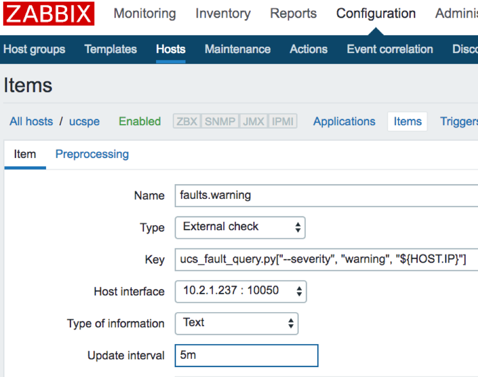
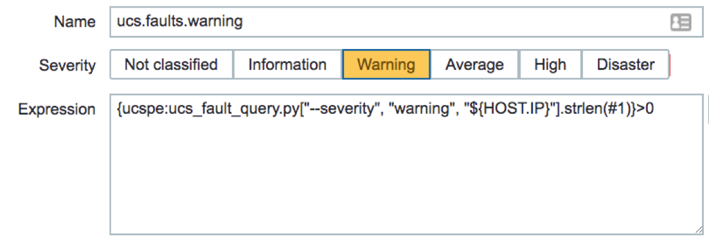
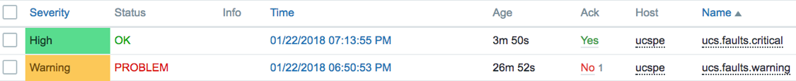
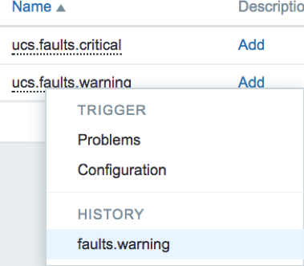
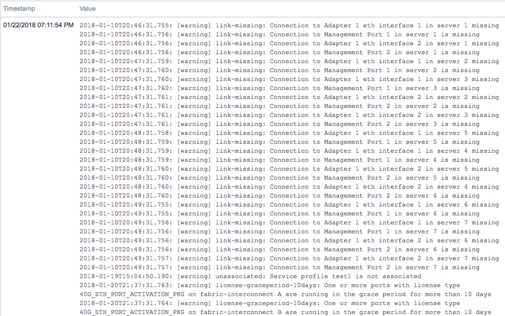

# Zabbix / Cisco UCS adapter

This repo contains a script to pull a list of current faults from a UCS Manager
(UCSM) or standalone Cisco Integrated Management Controller (IMC), optionally 
filtered by severity. There are instructions below on how to integrate this 
with the [Zabbix](https://www.zabbix.com/]) monitoring platform, and you can 
also just run it from the command line.

## Dependencies
* Python 3
* [ucsmsdk](https://github.com/CiscoUcs/ucsmsdk)
* [imcsdk](https://github.com/CiscoUcs/imcsdk)
* CIMC firmware version 1.5(4) or higher

## Installation (Unix-based)
1. Download the code to your Zabbix system.
2. Make the *ucs_fault_query.py* file executable.
    * `chmod +x ucs_fault_query.py`
3. Move it to the Zabbix external scripts directory.
    * `mv ucs_fault_query.py /usr/lib/zabbix/externalscripts/`
4. Edit the [ucs_credentials.ini](ucs_credentials.ini) file and input valid credentials. A read-only account is recommended.
5. Move the [ucs_credentials.ini](ucs_credentials.ini) file to /etc
    * `mv ucs_credentials.ini /etc`
    * Note: An alternate location/filename can be specified when running the
    script by using the *--config* option, or by editing ucs_fault_query.py
6. Run the script from the CLI to verify functionality.

## CLI usage and example
```
usage: ucs_fault_query.py [-h] [--config CONFIG]
                          [--severity {critical,major,minor,warning,info}]
                          [--type TYPE]
                          ucs_host [alt_address [alt_address ...]]

Get a list of current UCS device faults.

positional arguments:
  ucs_host              Name or IP address of the UCS device.
  alt_address           Space delimited list of alternate hostnames/addresses
                        to try

optional arguments:
  -h, --help           show this help message and exit
  --config CONFIG      Optional location of configuration file containing UCS
                       credentials. (Default: /etc/ucs_credentials.ini)
  --severity SEVERITY  Optional severity level to use as a filter. One of:
                       ['critical', 'major', 'minor', 'warning', 'info']
  --type TYPE          Host type ('ucsm' or 'imc'). Required unless provided
                       in the configuration file.

$ ./ucs_fault_query.py --severity warning 10.1.2.3
2018-01-10T20:46:31.755: [warning] link-missing: Connection to Adapter 1 eth interface 1 in server 1 missing
2018-01-10T20:46:31.756: [warning] link-missing: Connection to Management Port 1 in server 1 is missing
...

$ ./ucs_fault_query.py --severity critical 10.1.2.3
$
# Note: No output was generated above because there were no Critical faults.
```
If no severity is provided, then all faults will be returned.

## Zabbix Configuration

To integrate with Zabbix, we are going to use the 
[external check](https://www.zabbix.com/documentation/3.4/manual/config/items/itemtypes/external)
feature. Pictured below is an example of how you could configure an item in Zabbix to 
poll this data by running the script as an External check. The host interface 
is only useful to have a reference to the IP address. No Zabbix agent is
needed for this script to function.



Next you would create a trigger to alert you when the item returns a non-empty
result.



Repeat the above steps to create additional items/triggers for additional 
severities (critical, major, etc.) as needed. Now you will be able to see 
alerts when any of the monitored UCS faults are detected, and then look at the
item history to see more details.






